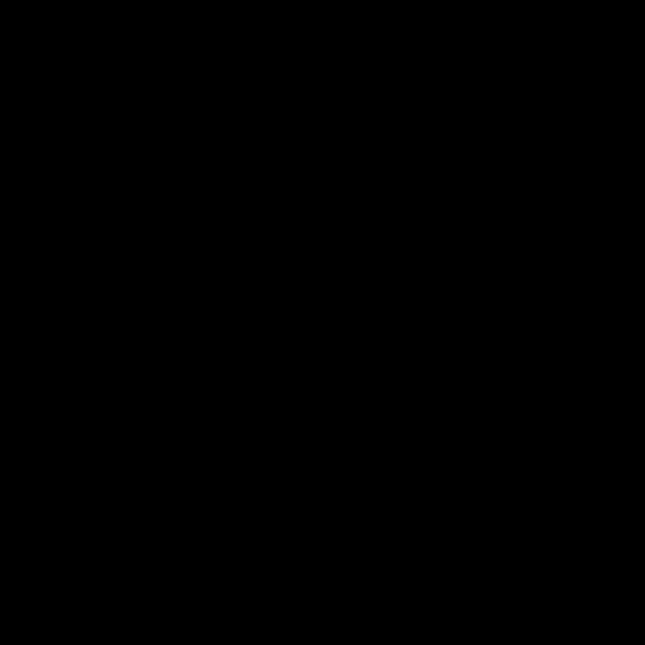

# ACC2025



---


This repository records the full journey of our autonomous driving project that started in the **Quanser QCar simulator** and scaled to the **real QCar2 platform**.  
Every directory’s README includes **failures** and **iteration logs**, not just final results.

---

## Operating Principles

- **Reproducibility** — Document code, configs, and data flows so others can produce the same results.
- **Layered Integration** — Build and verify in order: *Perception → Planning → Avoidance → Control → ROS 2 integration*, with clear interfaces at each layer.
- **Real-vehicle Validity** — After simulation passes, repeat on the real car and prioritize practical issues (SLAM, time sync, control latency).

---

## Repository Layout

| Directory | Role | Key Sub-Docs |
|---|---|---|
| `perception/` | Perception pipeline overview + detailed SCNN & YOLOv7 | `perception/README.md`, `perception/scnn/README.md`, `perception/yolov7/README.md` |
| `planning/` | Offline paths for a static track (RRT) + visit/order optimization (DQN) | `planning/README.md`, `planning/rrt/README.md`, `planning/dqn/README.md` |
| `Obstacle_Avoidance/` | Offset-curve–based obstacle avoidance path generation | `Obstacle_Avoidance/README.md` |
| `ros2_system/` | ROS 2 architecture, node wiring, Simulink codegen integration | `ros2_system/README.md`, `ros2_system/data_helper/README.md`, `ros2_system/cartographer/README.md` |
| `control/` | Control logic (steering: Pure Pursuit, speed: FSM-centric) | `control/README.md` |
| `hardware_setup/` | Jetson, RealSense, LiDAR, ESC wiring & comms | `hardware_setup/README.md` |
| `simulator_to_real/` | Transfer from simulator → real car: issues & fixes | `simulator_to_real/README.md` |
| `common_utils/` | CSV/JSON/logging/visualization/calibration utilities | `common_utils/README.md` |
| `docs/` | Competition report, poster, internal design docs | `docs/README.md` |

---

## System Overview (Summary)

### Sensors & Platform
- **RealSense D435i** — Primary perception source (RGB + Depth).
- **RPLIDAR A2M8** — SLAM (Cartographer) input.
- **Jetson AGX Orin** — On-board compute.
- **ESC/Servo** — MKSESC 75100 V2, Traxxas battery.

### Perception
- **Lanes**: SCNN (input **640×480**) → mask post-processing (**DBSCAN + 3rd-order polyfit**) → **centerline**.
- **Objects**: YOLOv7 (chose v7 over v8 due to Jetson compat) — stop line / crosswalk / traffic signs.
- **3D localization**: Fuse SCNN lane pixels with RealSense depth to generate a **3D centerline**.
- **Cross-check**: Compare SCNN 3D centerline with Cartographer pose to **monitor drift**.

### Planning
- **RRT**: Pre-generate segment waypoints on a static track (multi-run + quality filtering).
- **DQN**: Optimize the visit order of stops/waypoints → produce **`dqn_paths.json`**.
- **Execution**: `helper_path_sender` **streams waypoints on a timer (no reach checks)**; the FSM decides stop/start from independent criteria.

### Obstacle Avoidance
- Generate **offset-curve candidates**, pick minimal-clearance solution, and reconstruct a smooth avoidance path.  
  Uses **point-to-segment distance** for collision tests, smooths the avoidance segment, and **naturally merges back** to the base path.

### Control
- **Steering**: Pure Pursuit; look-ahead scheduled by vehicle speed & curvature.
- **Speed**: . Event-centric **Stateflow/FSM** for stop/start/pickup-dropoff/speed stages.
- **ESC actuation**: Step-wise throttle/brake tied to event timing (stability first).

### ROS 2 Integration
- **`data_helper`**: Bridge perception events → FSM control signals (`/stop`, `/pickup_dropoff`, `/path_mode`).
- **Cartographer**: LiDAR-based SLAM; TF/time-sync correction; drift checks vs SCNN centerline.
- **Simulink Codegen**: Control module compiled to **ROS 2 C++** node (build/launch details in `ros2_system/README.md`).

---

## Quick Start

### 1) Build the workspace
```bash
colcon build --symlink-install
source install/setup.bash
```
- `colcon build`: compile all ROS 2 packages.
- `--symlink-install`: faster dev loops by symlinking sources.
- `source install/setup.bash`: export build artifacts into the current shell.

### 2) Generate the DQN route sequence
```bash
# Example: publish stops/waypoints
ros2 topic pub /dqn_path_input std_msgs/Int32MultiArray "{data: [4, 7, 21, 33]}"
```
- Publishing to `/dqn_path_input` triggers the **DQNPathPlanner** node to create `dqn_paths.json` and publish `/dqn_done=True`.

### 3) Stream waypoints
```bash
# After /dqn_done=True, start streaming /path_x, /path_y
ros2 run path_planning helper_path_sender
```
- `helper_path_sender` reads `dqn_paths.json`, loads each segment’s `waypoints_*.json` in order, and **streams** `/path_x`, `/path_y` **without** reach checks.
- The **FSM** switches states using `/stop`, `/pickup_dropoff`, `/path_mode`.

> For launch/QoS/TF specifics, see `ros2_system/README.md` and each submodule’s README.

---

## Major Issues & How We Solved Them

### 1) YOLOv8 → YOLOv7
Jetson showed dependency conflicts and runtime instability with YOLOv8. Considering model/runtime compatibility and latency, we switched to **YOLOv7** and simplified the training/inference pipeline accordingly.

### 2) Event sync with the Simulink controller
Distance-based reach checks caused timing skew between ROS 2 events and the Simulink FSM.  
**Fix**: `helper_path_sender` streams waypoints **without** reach checks; the FSM performs transitions by **its own criteria** (time/pose/events).

### 3) SLAM drift accumulation
Cartographer drifted slightly over long runs.  
**Fix**: Compare **SCNN 3D centerline** against SLAM pose, log error trends, and trigger **relocalize / map reset** when thresholds are exceeded.

### 4) Continuity of avoidance paths
At path boundaries, avoidance used to break continuity.  
**Fix**: Merge **adjacent IDs** into a single curve for avoidance; generate offset candidates over the merged path, then smooth and **rejoin naturally**.

### 5) LiDAR–TF–Docker time mismatch
When Cartographer ran in Docker and LiDAR/TF on host, timestamps diverged.  
**Fix**: A dedicated **TF broadcaster** enforces frame/time alignment; tuned QoS for consistent SLAM inputs.

---

## Recommended Reading Order

1. **`perception/README.md`** — How SCNN & YOLOv7 are fused with RGB-D for on-vehicle perception (with failure logs).
2. **`planning/README.md` → `planning/rrt/`, `planning/dqn/`** — Why we moved to offline path generation + order optimization; review the **streaming** design in `helper_path_sender`.
3. **`Obstacle_Avoidance/README.md`** — Offset-curve, minimal-clearance avoidance (details & visuals).
4. **`ros2_system/README.md`** — `data_helper`, Cartographer, Simulink codegen, QoS/TF/time-sync.
5. **`control/README.md`** — Why **Pure Pursuit + FSM (no PID)**, parameter scheduling, and real-vehicle fixes.

---

## Tech Stack

- **ROS 2 Humble**, Python 3.10  
- **RealSense SDK**, **RPLIDAR SDK**  
- **SCNN** (PyTorch training + custom inference), **YOLOv7**  
- **MATLAB/Simulink R2024b** codegen → ROS 2 **C++** node  
- **Docker** (optional, to isolate SLAM/Perception)

---

## Achievements

- **American Control Conference Student Challenge 2025 — Finalist**  
- **Kookmin University Self-Driving Competition 2025 — Finalist**  
- Delivered a real-vehicle pipeline: **RGB-D perception**, **SLAM cross-checks**, and **streaming planning→control integration**.
